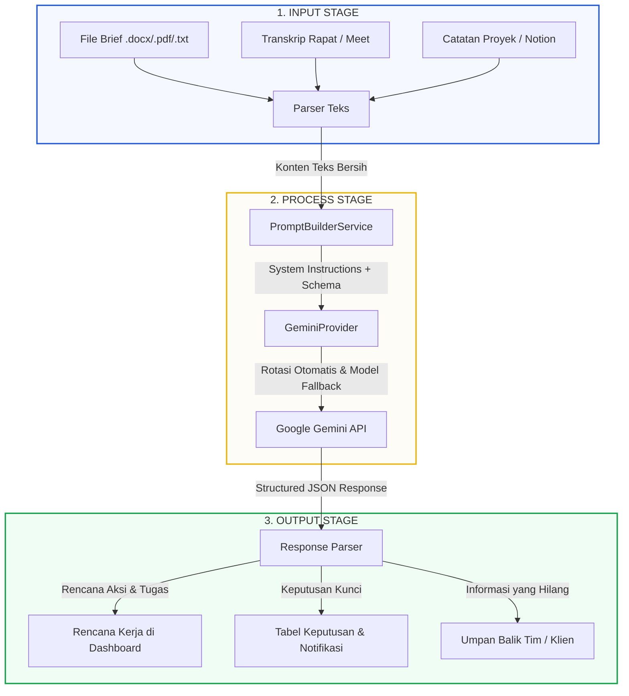

# Dokumen Teknis: Alur Kerja & Mekanisme Engine AI Koladi
> **Estimasi waktu baca/presentasi:** 60–90 detik  
> **Fokus Bahasan:** Input-Process-Output (IPO), Mekanisme Failover API Key, Struktur Prompt, dan Integrasi Sistem Koladi.

---

## 1. Arsitektur Input–Process–Output (IPO)

Sistem AI di Koladi didesain menggunakan skema pemrosesan data terstruktur yang mengubah dokumen mentah (brief proyek) menjadi rencana aksi siap pakai di level database.



---

## 2. Mekanisme Pemrosesan & Algoritma di Balik Layar

Proses analisis berjalan dalam waktu rata-rata **5 hingga 12 detik** di server dengan urutan operasi sebagai berikut:

### A. Rekayasa Prompt Terstruktur (Prompt Engineering)
`PromptBuilderService` menggabungkan teks brief proyek dengan 4 komponen instruksi utama untuk menjamin konsistensi hasil:
1. **SYSTEM**: Menetapkan peran AI sebagai Project Manager Senior.
2. **GUARDRAILS**: Batasan keamanan agar AI tidak berasumsi di luar data dokumen.
3. **OUTPUT RULES**: Format ketat output berupa JSON (tidak boleh ada teks pembuka/penutup).
4. **JSON SCHEMA**: Struktur data JSON target (berdasarkan `response-schema.json`) yang memaksa AI mengisi objek yang sudah didefinisikan (Tujuan Utama, Deliverables, Rencana Tugas, Keputusan Kunci, & Informasi yang Kurang).

### B. Algoritma Ketahanan API (Multi-Model & Key Fallback)
Untuk mencegah kegagalan sistem akibat limit kuota (`429 Rate Limit`) atau kendala jaringan (`503 Service Unavailable`), `GeminiProvider` menerapkan algoritma rotasi beruntun:

```
[Mulai Permintaan]
       ↓
[Gunakan Model Utama: gemini-3.5-flash]
       ↓
  ┌───[Coba API Key #1] ──(Sukses)──> [Return JSON]
  │    ↓ (Error 429 / Limit)
  ├───[Rotasi ke API Key #2] ──(Sukses)──> [Return JSON]
  │    ↓ (Error 429 / Limit)
  ├───[Rotasi ke API Key #3] ──(Sukses)──> [Return JSON]
  │    ↓ (Error 429 / Limit)
  └───[Rotasi ke API Key #4] ──(Semua Key Limit)──> [Switch ke Model Cadangan]
                                                           ↓
                                              [Model: gemini-3.1-flash-lite]
                                              (Ulangi Rotasi Key #1 s/d #4)
```

- **Exponential Backoff**: Jika terjadi error server (HTTP 503), sistem akan melakukan *sleep* selama 2 detik sebelum mencoba kembali satu kali lagi pada key yang sama sebelum berpindah.

---

## 3. Integrasi Data & Kolaborasi (Human-in-the-Loop)

Hasil analisis AI tidak langsung dieksekusi secara buta ke dalam database produksi untuk menghindari kesalahan tafsir. Sistem Koladi menggunakan mekanisme **Human-in-the-Loop**:

1. **Reviewer Aktif (Aktor: Project Leader / Admin)**:
   - Data analisis (Goal, Tasks, Decisions) ditampilkan dalam bentuk draf interaktif di halaman `ai-brief.blade.php`.
   - Project Leader berhak mengubah judul tugas, menghapus rencana keputusan, merevisi tanggal deadline, atau menugaskan langsung ke anggota tim di tempat sebelum disetujui.
2. **Eksekusi Otomatis (Proses dengan AI)**:
   - Setelah disetujui, sistem backend mengurai (*parsing*) data tersebut.
   - **Tugas** secara otomatis dibuat menjadi kartu-kartu di **Kanban Board** proyek.
   - **Keputusan Kunci** disimpan ke tabel `decisions` dan mentrigger notifikasi sistem kepada seluruh anggota workspace yang bersangkutan.

---

## 4. Nilai Manfaat bagi Pengguna

- **Kecepatan Inisiasi Proyek**: Menghemat waktu perencanaan dari yang biasanya memakan waktu beberapa jam analisis dokumen, menjadi kurang dari 1 menit draf siap pakai.
- **Konsistensi Format**: Semua proyek memiliki standarisasi draf awal yang rapi (Tujuan, Tugas, dan Target) tanpa ada bagian penting yang terlewat.
- **Transparansi Keputusan**: Tim langsung mengetahui keputusan-keputusan krusial berkat pencatatan log keputusan otomatis sejak awal proyek dimulai.
