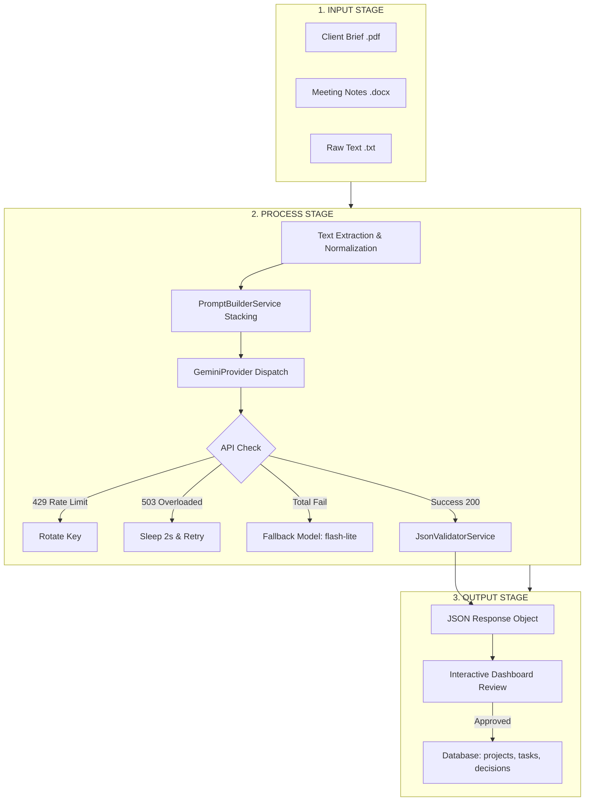

# CARA KERJA LENGKAP ENGINE AI (AI BRIEF PARSER) - KOLADI

Dokumen ini menjelaskan **secara menyeluruh, detail, dan komprehensif** tentang logika inti, algoritma, model, aturan rekayasa, pemrosesan **Input-Process-Output (IPO)**, hingga **Kondisi Pengecualian (Exception Handling)** pada engine AI di aplikasi Koladi.

---

## 📄 DAFTAR ISI
1. [Konsep Dasar & Filosofi AI di Koladi](#1-konsep-dasar--filosofi-ai-di-koladi)
2. [Logika Inti Solusi (Algoritma, Model, Rumus & Aturan)](#2-logika-inti-solusi-algoritma-model-rumus--aturan)
   - [2.1 Spesifikasi Model AI & Hyperparameter](#21-spesifikasi-model-ai--hyperparameter)
   - [2.2 Algoritma Inti & Heuristik](#22-algoritma-inti--heuristik)
   - [2.3 Aturan Rekayasa (Guardrails & Constraints)](#23-aturan-rekayasa-guardrails--constraints)
3. [Detail Pemrosesan Input, Proses, dan Output (IPO)](#3-detail-pemrosesan-input-proses-dan-output-ipo)
   - [3.1 Matriks Input](#31-matriks-input)
   - [3.2 Alur Pemrosesan (Pipeline Process)](#32-alur-pemrosesan-pipeline-process)
   - [3.3 Matriks Output (Structured JSON Schema)](#33-matriks-output-structured-json-schema)
4. [Kondisi Pengecualian & Penanganan Error (Exception Handling)](#4-kondisi-pengecualian--penanganan-error-exception-handling)
5. [Proses di Balik Layar: Langkah demi Langkah](#5-proses-di-balik-layar-langkah-demi-langkah)
6. [Bagaimana LLM "Berpikir" (Tokenisasi & Inferensi Teks)](#6-bagaimana-llm-berpikir-tokenisasi--inferensi-teks)
7. [Mekanisme Human-in-the-Loop & Integrasi Database](#7-mekanisme-human-in-the-loop--integrasi-database)
8. [Matriks Keamanan & Anti-Halusinasi](#8-matriks-keamanan--anti-halusinasi)
9. [Ringkasan Nilai Manfaat](#9-ringkasan-nilai-manfaat)

---

## 1. KONSEP DASAR & FILOSOFI AI DI KOLADI

### Apa Peran AI di Koladi?
AI di Koladi berfungsi sebagai **AI Project Planning Assistant** (Asisten Perencanaan Proyek). 

> **Prinsip Utama:** 
> * AI **BUKAN** chatbot umum (seperti ChatGPT interaktif).
> * AI **BUKAN** pengambil keputusan akhir (mengusung konsep *Human-in-the-Loop*).
> * AI bertugas mengubah dokumen acak (PDF, Word, TXT, Transkrip Meeting) menjadi **Draft Project, Deliverables, & Tasks** yang terstruktur secara otomatis.

---

## 2. LOGIKA INTI SOLUSI (ALGORITMA, MODEL, RUMUS & ATURAN)

### 2.1 Spesifikasi Model AI & Hyperparameter

Engine AI Koladi dikonfigurasi secara presisi melalui `GeminiProvider` untuk menghasilkan luaran yang deterministik dan konsisten:

| Parameter | Setting / Nilai | Alasan Rekayasa |
| :--- | :--- | :--- |
| **Model Utama (*Primary*)** | `gemini-3.5-flash` | Memiliki pemahaman konteks tinggi (*high-context window*) dan kecepatan inferensi yang sangat tinggi. |
| **Model Cadangan (*Fallback*)** | `gemini-3.1-flash-lite` | Digunakan jika model utama mengalami kehabisan kuota atau downtime total. |
| **Temperature** | `0.2` | Nilai rendah untuk menekan kreativitas liar AI dan memaksa luaran konsisten (*deterministic/factual*). |
| **Max Output Tokens** | `6144` | Memberikan ruang yang cukup untuk mengekstrak puluhan task dan keputusan tanpa terpotong (*truncated*). |
| **Response MIME Type** | `application/json` | Mengunci respons API agar wajib berupa format JSON murni. |
| **Response Schema** | `response-schema.json` | Penegakan skema ketat di tingkat API Gemini. |

---

### 2.2 Algoritma Inti & Heuristik

Engine AI menerapkan 4 algoritma/heuristik inti dalam memproses brief proyek:

#### 1. Algoritma Ketahanan API (Multi-Tier Failover & Key Rotation)
Algoritma ini menjamin ketersediaan layanan (*High Availability*) dengan matriks keputusan berikut:
- **HTTP 429 (Rate Limit):** Rotasi *instant* ke API Key berikutnya ($Key_{n+1}$).
- **HTTP 503 (Server Overloaded):** Terapkan *Fixed Delay Backoff* (tunggu 2 detik), lalu melakukan *retry* 1x pada key yang sama. Jika masih gagal, beralih ke key berikutnya.
- **Model Exhaustion:** Jika seluruh API Key ($Key_1 \dots Key_4$) pada model utama gagal, algoritma otomatis menurunkan permintaan (*graceful degradation*) ke model cadangan.

#### 2. Heuristik Klasifikasi Prioritas Tugas (Priority Rules)
AI mengelompokkan setiap tugas (`tasks[].priority`) menggunakan aturan semantik:
- **`HIGH`**: Tugas yang merupakan *blocker*, arsitektur inti, keamanan, integrasi payment gateway, atau memiliki batas waktu mendesak.
- **`MEDIUM`**: Tugas pengembangan fitur utama (CRUD, UI/UX halaman utama, manajemen user).
- **`LOW`**: Tugas dokumentasi, polishing UI, optimasi opsional, atau fitur tambahan pendukung.

#### 3. Heuristik Estimasi Beban Kerja (Estimated Hours Rules)
AI memperkirakan `estimated_hours` per tugas berdasarkan standar pengembangan software:
- Tugas kecil (misal: penyiapan DB / setup repo): $2 - 4$ jam.
- Tugas sedang (misal: pembuatan form / API endpoint): $4 - 8$ jam.
- Tugas kompleks (misal: integrasi Payment Gateway / UI/UX multi-screen): $8 - 16+$ jam.

#### 4. Algoritma Pelacakan Sumber (Multi-Document Traceability Matching)
Setiap entitas yang diekstrak wajib menyertakan atribut `sources: ["NamaFile.pdf"]`. Algoritma memetakan klausa teks pada dokumen asal dengan potongan tugas/keputusan yang dihasilkan sehingga pengguna dapat memverifikasi kebenaran data (*fact-checking*).

---

### 2.3 Aturan Rekayasa (Guardrails & Constraints)

1. **Zero Assumption / Strict Anti-Hallucination Rule:**
   - AI **dilarang keras** mengarang tanggal, nama klien, atau anggaran yang tidak tertulis eksplisit dalam dokumen.
   - Informasi yang ambigu atau tidak ditemukan wajib dimasukkan ke dalam atribut `missing_information` atau `clarification_questions`.
2. **Deterministic Output Enforcement:**
   - Menyertakan contoh format JSON target pada *System Prompt* serta melampirkan skema resmi untuk mencegah pengembalian teks percakapan pembuka/penutup.

---

## 3. DETAIL PEMROSESAN INPUT, PROSES, DAN OUTPUT (IPO)



### 3.1 Matriks Input

| Parameter Input | Tipe Data | Deskripsi / Batasan |
| :--- | :--- | :--- |
| **Uploaded Files** | File Binary (`.pdf`, `.docx`, `.txt`) | Dokumen brief, proposal, atau transkrip percakapan proyek. |
| **Max File Size** | Numeric | Maksimal 10 MB per file. |
| **Text Content** | String (UTF-8) | Hasil ekstraksi teks bersih tanpa karakter anomali/binary. |
| **System Prompt & Schema** | Structured JSON | Instruksi guardrails dan skema struktur JSON target. |

---

### 3.2 Alur Pemrosesan (Pipeline Process)

1. **Extraction Phase:** File diurai oleh PDF/Docx parser di backend Laravel untuk mengambil string mentahnya.
2. **Context Stacking Phase:** Jika terdapat lebih dari 1 file, teks digabung menjadi satu blok dokumen terintegrasi dengan header pemisah `--- File: [Nama_File] ---`.
3. **Prompt Injection Phase:** `PromptBuilderService` menggabungkan konteks dokumen dengan aturan *System Instruction*, *Guardrails*, dan *Response Schema*.
4. **API Execution Phase:** `GeminiProvider` melakukan HTTP POST request ke API Google Gemini.
5. **Validation Phase:** `JsonValidatorService` membersihkan pembungkus markdown (seperti ` ```json `), mem-parse JSON, dan memastikan atribut wajib tidak `null`.

---

### 3.3 Matriks Output (Structured JSON Schema)

Hasil eksekusi dikembalikan dalam bentuk **JSON Terstruktur** murni:

```json
{
  "project_name": "Pengembangan E-Commerce Batik",
  "summary": "Ringkasan proyek pengembangan aplikasi web batik berbasis Laravel...",
  "objective": "Meningkatkan penjualan batik secara online dengan sistem pembayaran otomatis.",
  "deliverables": [
    "Aplikasi Web Customer",
    "Admin Panel Dashboard",
    "Integrasi Payment Gateway Midtrans"
  ],
  "tasks": [
    {
      "title": "Desain UI/UX Wireframe Dashboard",
      "description": "Membuat wireframe 5 halaman utama aplikasi.",
      "priority": "HIGH",
      "estimated_hours": 16,
      "sources": ["Client Brief Batik.pdf"]
    },
    {
      "title": "Integrasi API Midtrans",
      "description": "Mengimplementasikan webhook payment notification.",
      "priority": "HIGH",
      "estimated_hours": 12,
      "sources": ["Meeting Transcript.docx"]
    }
  ],
  "decisions": [
    {
      "decision": "Menggunakan Midtrans sebagai Payment Gateway utama",
      "rationale": "Disepakati karena mendukung metode QRIS dan Transfer Bank lokal.",
      "sources": ["Meeting Transcript.docx"]
    }
  ],
  "missing_information": [
    "Brand Guideline (Palet Warna & Logo)",
    "Akses Server Hosting / Domain Client"
  ],
  "clarification_questions": [
    "Apakah metode pembayaran Cash on Delivery (COD) perlu disediakan pada fase 1?"
  ]
}
```

---

## 4. KONDISI PENGECUALIAN & PENANGANAN ERROR (EXCEPTION HANDLING)

Untuk menjamin keandalan sistem (*reliability*), berikut adalah matriks kondisi pengecualian (*edge cases*) dan mitigasi otomatis yang diterapkan oleh Koladi:

| # | Kondisi Pengecualian / Error | Penyebeb | Deteksi / Indikator | Tindakan Mitigasi Otomatis |
| :-: | :--- | :--- | :--- | :--- |
| **1** | **Dokumen Kosong / Binary Unreadable** | File PDF terenkripsi, corrupt, atau berupa hasil scan gambar tanpa teks (OCR needed). | Teks hasil ekstraksi berukuran 0 byte atau hanya berisi karakter anomali. | Semburkan `RuntimeException` dengan pesan: *"Dokumen tidak berisi teks yang dapat dibaca."* Minta pengguna mengunggah file valid. |
| **2** | **HTTP 429 Rate Limit Exceeded** | API Key mencapai kuota batas transaksi per menit (TPM/RPM). | Response status HTTP = `429`. | `GeminiProvider` menangkap status 429 dan secara instant merotasi panggilan ke **API Key #2 / #3 / #4**. |
| **3** | **HTTP 503 Server Overloaded** | Server Google Gemini mengalami lonjakan beban sementara. | Response status HTTP = `503`. | `GeminiProvider` mengeksekusi `sleep(2)` (delay 2 detik) lalu mencoba **retry 1x** pada key yang sama. |
| **4** | **Semua Key & Model Utama Fail** | Seluruh kuota API key habis dan model utama bermasalah. | Loop API Key pada model utama habis (`RuntimeException`). | Sistem melakukan *Graceful Degradation* dengan beralih ke model cadangan `gemini-3.1-flash-lite`. |
| **5** | **JSON Response Rusak / Truncated** | AI terputus di tengah jalan karena kehabisan token (`maxOutputTokens`). | `json_decode()` mengembalikan error `JSON_ERROR_SYNTAX` atau `finishReason` = `MAX_TOKENS`. | `JsonValidatorService` mencoba melakukan pembersihan regex/repair. Jika gagal total, sistem meminta AI melakukan regenerasi ulang. |
| **6** | **Dokumen Tidak Relevan** | User mengunggah file yang bukan brief proyek (misal: resep makanan, cerpen). | AI tidak menemukan entitas proyek / `tasks` kosong. | Engine tetap mengembalikan JSON valid, namun `project_name` diset *"Unidentified Project"* dan daftar `missing_information` diisi penjelasan ketidaksesuaian dokumen. |

---

## 5. PROSES DI BALIK LAYAR: LANGKAH DEMI LANGKAH

### Langkah 1: Document Parsing & Text Extraction
1. Backend Laravel menerima berkas unggahan pengguna.
2. Library ekstraksi mengekstrak teks mentah.
3. **Text Normalization**: Menghilangkan karakter anomali, merapikan spasi berlebih, dan memastikan encoding UTF-8.

### Langkah 2: Context Building & Multi-Document Stacking
1. Teks dari setiap dokumen digabungkan menjadi **satu kesatuan konteks**.
2. Setiap dokumen diberi penanda sumber (*Source Identifier*) untuk mendukung **Traceability**.

### Langkah 3: Prompt Engineering & Guardrails
Backend Laravel ([PromptBuilderService.php](file:///Users/pinkman/Documents/project/koladi-laravel/app/Services/AI/PromptBuilderService.php)) menyusun instruksi khusus berisi 4 komponen utama:
1. **SYSTEM INSTRUCTION**: Penetapan peran AI sebagai Senior PM.
2. **GUARDRAILS**: Larangan keras berasumsi atau mengarang data.
3. **TRACEABILITY RULE**: Kewajiban menyertakan nama dokumen sumber.
4. **OUTPUT FORMAT RULE**: Penegakan JSON murni.

### Langkah 4: Structured Output (JSON Schema Enforcement)
Melampirkan `response-schema.json` ke API Gemini untuk mengunci atribut wajib secara ketat.

### Langkah 5: Execution via GeminiProvider
Melakukan eksekusi HTTP dengan rotasi key & fallback model otomatis jika terjadi kendala jaringan/limit.

---

## 6. BAGAIMANA LLM "BERPIKIR" (TOKENISASI & INFERENSI TEKS)

Di tingkat terdasar (di infrastruktur Google Gemini):
1. **Tokenisasi**: Teks dokumen dipecah menjadi unit **token** (1 token ≈ 4 karakter atau 0.75 kata).
2. **Context Window Processing**: Seluruh token diproses dalam *Neural Network Transformer* menggunakan *Self-Attention Mechanism*.
3. **Pattern Matching & Semantic Extraction**: Model menghubungkan frasa seperti *"harus selesai tanggal 15"* sebagai **Deadline**, dan *"membuat halaman login"* sebagai **Task**.
4. **JSON Output Generation**: Model menyusun token demi token sesuai dengan JSON Schema yang dikunci oleh Laravel.

---

## 7. MEKANISME HUMAN-IN-THE-LOOP & INTEGRASI DATABASE

Hasil keluaran AI **tidak langsung disimpan ke database produksi secara permanen**, melainkan melewati tahap verifikasi manusia:

```
[Hasil AI (Draf JSON)] 
        ↓
[Tampilan Draf Interaktif di Dashboard (ai-brief.blade.php)]
        ↓
[Project Manager Review & Edit Manual]
   - Menghapus task yang tidak sesuai
   - Mengubah durasi / priority task
   - Mengedit nama project
        ↓
[User Klik Tombol "Approve & Create Project"]
        ↓
[Laravel Backend Menyimpan ke DB (Tabel projects, tasks, decisions)]
```

---

## 8. MATRIKS KEAMANAN & ANTI-HALUSINASI

| Potensi Masalah AI | Cara Koladi Mengatasinya |
| :--- | :--- |
| **Halusinasi Data** | **Guardrails Ketat**: AI dilarang berasumsi. Data tidak jelas wajib masuk ke `missing_information`. |
| **Format Rusak** | **Structured JSON Schema**: Dikunci langsung di API Gemini via `responseSchema`. |
| **Downtime / API Limit** | **Multi-API Key Rotation & Multi-Model Fallback** (Auto failover dari Flash ke Flash-Lite). |
| **Penelusuran Sumber** | **Traceability System**: Setiap task mencantumkan `sources: ["file_asal.pdf"]`. |

---

## 9. RINGKASAN NILAI MANFAAT

1. **Efisiensi Waktu (Hingga 90%)**: Memangkas waktu analisis brief proyek dari 1–2 jam manual menjadi kurang dari **10 detik**.
2. **Standardisasi Output**: Semua draf proyek memiliki format konsisten (Summary, Tasks, Priority, Decisions, Missing Info).
3. **Akurasi & Keamanan Tinggi**: Didukung penanganan error lengkap dan persetujuan manusia (*Human-in-the-Loop*).
