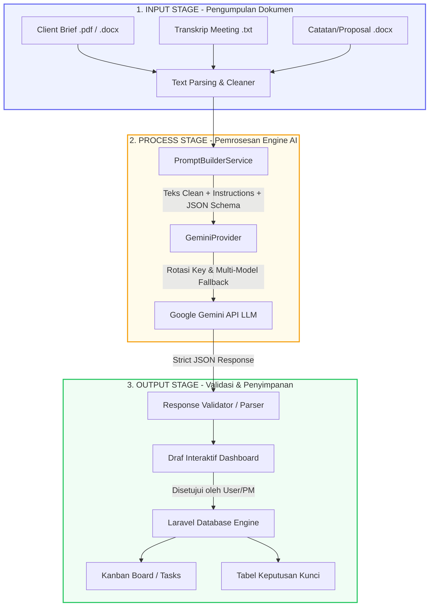
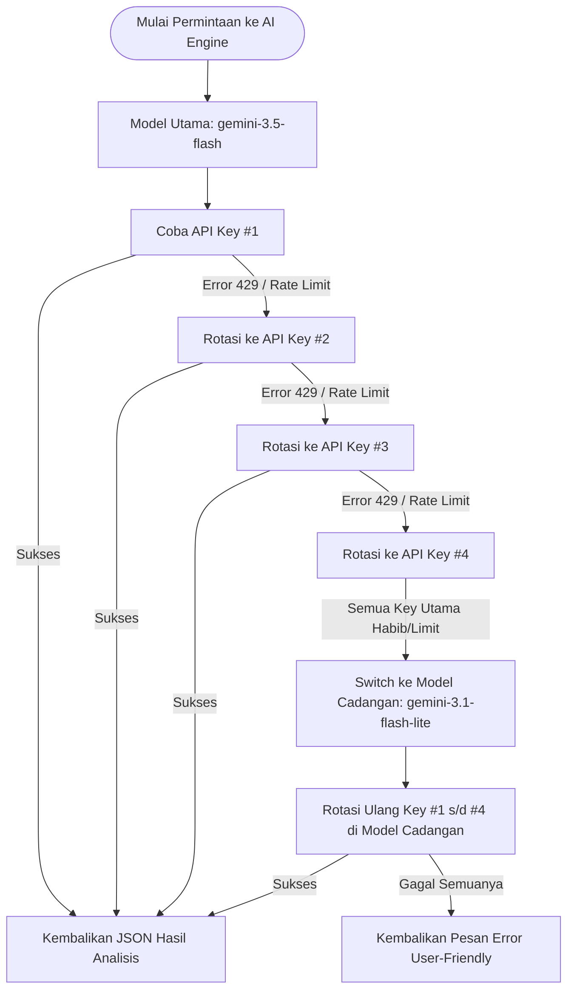

# CARA KERJA LENGKAP ENGINE AI (AI BRIEF PARSER) - KOLADI

Dokumen ini menjelaskan **secara menyeluruh dan detail** bagaimana fitur AI pada proyek Koladi bekerja: mulai dari proses konseptual di balik Machine Learning / Large Language Model (LLM), pemrosesan data teknis (Input-Process-Output), teknik *Prompt Engineering*, penanganan *Failover/Resilience*, hingga bagaimana hasil AI diubah menjadi data nyata di database Koladi.

---

## 📄 DAFTAR ISI
1. [Konsep Dasar & Filosofi AI di Koladi](#1-konsep-dasar--filosofi-ai-di-koladi)
2. [Arsitektur Sistem & Alur Pemrosesan (IPO)](#2-arsitektur-sistem--alur-pemrosesan-ipo)
3. [Proses di Balik Layar: Langkah demi Langkah](#3-proses-di-balik-layar-langkah-demi-langkah)
   - [Langkah 1: Document Parsing & Text Extraction](#langkah-1-document-parsing--text-extraction)
   - [Langkah 2: Context Building & Multi-Document Stacking](#langkah-2-context-building--multi-document-stacking)
   - [Langkah 3: Prompt Engineering & Guardrails](#langkah-3-prompt-engineering--guardrails)
   - [Langkah 4: Structured Output (JSON Schema Enforcement)](#langkah-4-structured-output-json-schema-enforcement)
   - [Langkah 5: Algoritma Ketahanan API (Rotasi Key & Fallback Model)](#langkah-5-algoritma-ketahanan-api-rotasi-key--fallback-model)
4. [Bagaimana LLM "Berpikir" (Tokenisasi & Inferensi Teks)](#4-bagaimana-llm-berpikir-tokenisasi--inferensi-teks)
5. [Mekanisme Human-in-the-Loop & Integrasi Database](#5-mekanisme-human-in-the-loop--integrasi-database)
6. [Fitur Keselamatan & Anti-Halusinasi](#6-fitur-keselamatan--anti-halusinasi)
7. [Ringkasan Nilai Manfaat](#7-ringkasan-nilai-manfaat)

---

## 1. KONSEP DASAR & FILOSOFI AI DI KOLADI

### Apa Peran AI di Koladi?
AI di Koladi berfungsi sebagai **AI Project Planning Assistant** (Asisten Perencanaan Proyek). 

> **Prinsip Utama:** 
> * AI **BUKAN** chatbot umum (seperti ChatGPT interaktif).
> * AI **BUKAN** pengambil keputusan akhir (Human-in-the-loop).
> * AI bertugas mengubah dokumen acak (PDF, Word, TXT, Transkrip Meeting) menjadi **Draft Project & Task** yang terstruktur secara otomatis.

### Masalah yang Diselesaikan AI
Dalam manajemen proyek, dokumen awal (*project brief*) seringkali:
- Tidak terstruktur dan tersebar di banyak dokumen.
- Memiliki campuran bahasa (Indonesia & Inggris / Bahasa Gaul/Istilah Istilah Teknis).
- Berisi banyak detail tersembunyi yang rentan terlewatkan jika dibaca manual.

AI bertugas membaca seluruh dokumen tersebut dalam hitungan detik, mengekstrak poin penting, lalu menyajikannya dalam format siap pakai.

---

## 2. ARSITEKTUR SISTEM & ALUR PEMROSESAN (IPO)

Secara garis besar, alur kerja AI mengikuti prinsip **Input → Process → Output (IPO)**:



---

## 3. PROSES DI BALIK LAYAR: LANGKAH DEMI LANGKAH

### Langkah 1: Document Parsing & Text Extraction
Saat pengguna mengunggah berkas (*Client Brief.pdf*, *Meeting Transcript.docx*, atau file `.txt`):
1. **File Handler** menerima berkas di backend Laravel.
2. Library ekstraksi teks (misal: PDF Parser / Docx Parser) mengekstrak seluruh teks mentah dari dokumen.
3. **Text Normalization**: Menghilangkan karakter anomali, merapikan spasi berlebih, dan memastikan encoding teks menggunakan UTF-8.

---

### Langkah 2: Context Building & Multi-Document Stacking
Jika pengguna mengunggah **lebih dari satu dokumen** sekaligus (misal: *Brief.pdf* + *Notes.txt*):
1. Teks dari setiap dokumen digabungkan menjadi **satu kesatuan konteks**.
2. Setiap dokumen diberi penanda sumber (*Source Identifier*) agar AI dapat melakukan **Traceability** (mencatat tugas ini berasal dari dokumen mana).

---

### Langkah 3: Prompt Engineering & Guardrails
Backend Laravel (`PromptBuilderService`) menyusun instruksi khusus yang dikirimkan ke model AI. Prompt ini tidak hanya berisi teks dokumen pengguna, tetapi juga **4 Komponen Utama**:

1. **SYSTEM INSTRUCTION (Peran AI)**
   > *"Anda adalah seorang Senior Project Manager profesional. Tugas Anda adalah menganalisis dokumen proyek dan mengekstrak informasi menjadi rencana kerja yang rapi."*

2. **GUARDRAILS (Aturan Keselamatan & Anti-Halusinasi)**
   > *"DILARANG mengarang atau berasumsi informasi yang tidak tertulis pada dokumen. Jika informasi seperti deadline atau budget tidak ada, set nilainya menjadi null atau masukkan ke daftar missing_information."*

3. **TRACEABILITY RULE**
   > *"Setiap task atau deliverable wajib menyertakan nama dokumen sumber dari mana informasi tersebut diambil."*

4. **OUTPUT FORMAT RULE**
   > *"Output WAJIB dalam bentuk JSON murni tanpa ada teks pembuka, penutup, atau format markdown pembungkus."*

---

### Langkah 4: Structured Output (JSON Schema Enforcement)
Untuk memastikan AI tidak membalas dengan teks biasa ("Halo, berikut hasil analisis saya..."), sistem Koladi melampirkan **JSON Schema Definition** (`response-schema.json`) ke API Gemini.

Skema JSON memaksa AI mengembalikan data dalam format struktur berikut:

```json
{
  "project_name": "Pengembangan E-Commerce Batik",
  "summary": "Ringkasan proyek pengembangan aplikasi web batik...",
  "objective": "Tujuan utama proyek...",
  "deliverables": ["Web Customer", "Admin Panel", "Payment Gateway Integration"],
  "tasks": [
    {
      "title": "Desain UI/UX Wireframe",
      "description": "Membuat wireframe 5 halaman utama...",
      "priority": "HIGH",
      "estimated_hours": 16,
      "sources": ["Client Brief.pdf"]
    }
  ],
  "decisions": [
    {
      "decision": "Menggunakan Midtrans sebagai Payment Gateway",
      "rationale": "Disepakati saat meeting karena biaya transaksi lebih rendah.",
      "sources": ["Meeting Transcript.docx"]
    }
  ],
  "missing_information": ["Dokumen Brand Guideline", "Akses API Hosting"],
  "clarification_questions": ["Apakah metode pembayaran COD perlu disediakan?"]
}
```

---

### Langkah 5: Algoritma Ketahanan API (Rotasi Key & Fallback Model)
Proses pemrosesan AI membutuhkan koneksi API ke Google Gemini. Untuk menjamin sistem **tidak pernah down** akibat limit kuota (HTTP 429) atau kendala server (HTTP 503), `GeminiProvider` menerapkan algoritma ketahanan otomatis:



- **Exponential Backoff**: Jika terjadi error server sementara (HTTP 503), sistem secara otomatis melakukan jeda (*sleep*) selama 2 detik sebelum mencoba ulang (*retry*) pada API Key yang sama.

---

## 4. BAGAIMANA LLM "BERPIKIR" (TOKENISASI & INFERENSI TEKS)

Di tingkat terdasar (di server Google Gemini):
1. **Tokenisasi**: Dokumen teks dipecah menjadi unit terpecah yang disebut **token** (1 token ≈ 4 karakter atau 0.75 kata).
2. **Context Window Processing**: Seluruh token diproses dalam *Neural Network Transformer*. Model mengukur hubungan antarkata (menggunakan mekanisme *Attention Mechanism*).
3. **Pattern Matching & Semantic Extraction**: Model mengenali bahwa kata-kata seperti *"harus selesai tanggal 15"* mengindikasikan **Deadline**, sedangkan *"akan dibuat sistem pembayaran"* mengindikasikan **Deliverable**.
4. **JSON Output Generation**: Model menyusun kata per kata (*token by token*) mengikuti batasan JSON Schema yang dikirimkan oleh sistem Laravel Koladi.

---

## 5. MEKANISME HUMAN-IN-THE-LOOP & INTEGRASI DATABASE

Hasil AI **tidak langsung dimasukkan ke database utama secara otomatis**. Sistem Koladi menerapkan mekanisme **Human-in-the-Loop** untuk mencegah kesalahan:

```
[Hasil AI (Draf JSON)] 
        ↓
[Tampilan Draf Interaktif di UI Dashboard (ai-brief.blade.php)]
        ↓
[Project Manager Melakukan Edit / Review Manual]
   - Menghapus task yang tidak relevan
   - Mengubah estimasi jam / priority
   - Mengubah nama project
        ↓
[User Klik Tombol "Approve & Create Project"]
        ↓
[Laravel Backend Menyimpan ke Database (Tabel projects, tasks, decisions)]
```

### Manfaat Approach Ini:
- **Kontrol Penuh di Tangan Manusia**: Pengguna memiliki kata terakhir.
- **Keamanan Data**: Mencegah data sampah masuk ke database produksi.

---

## 6. FITUR KESELAMATAN & ANTI-HALUSINASI

| Potensi Masalah AI | Cara Koladi Mengatasinya |
| :--- | :--- |
| **Halusinasi** (AI mengarang info yang tidak ada) | **System Guardrails**: AI dilarang berasumsi. Info tidak lengkap wajib dimasukkan ke `missing_information`. |
| **Format Rusak** (JSON tidak valid) | **Structured JSON Schema**: API Gemini dikunci menggunakan instruksi skema data ketat. |
| **API Limit / Sever Error** | **Rotasi Multi-API Key & Multi-Model Fallback** (Auto failover dari Flash ke Flash-Lite). |
| **Kesalahan Identifikasi Sumber** | **Traceability System**: AI mencantumkan nama dokumen asal untuk setiap tugas/keputusan. |

---

## 7. RINGKASAN NILAI MANFAAT

1. **Efisiensi Waktu (Up to 90%)**: Memangkas waktu pembuatan perencanaan proyek dari 1–2 jam analisis manual menjadi kurang dari **10 detik**.
2. **Standardisasi Perencanaan**: Semua draf proyek memiliki struktur yang rapi (Objective, Deliverables, Tasks, Decisions, Missing Info).
3. **Kolaborasi Lebih Cepat**: Tim langsung mengetahui apa saja info yang masih kurang (*missing information*) untuk ditanyakan kembali ke klien.
